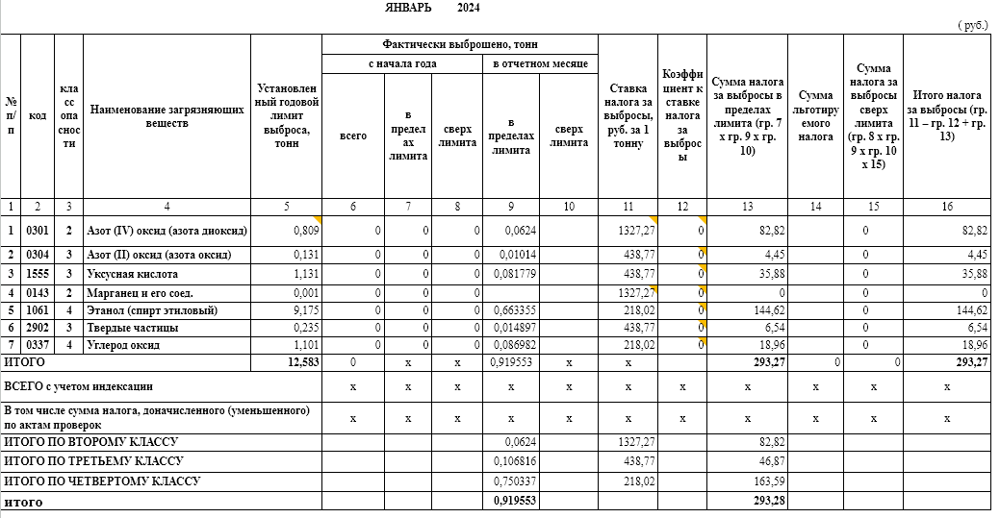
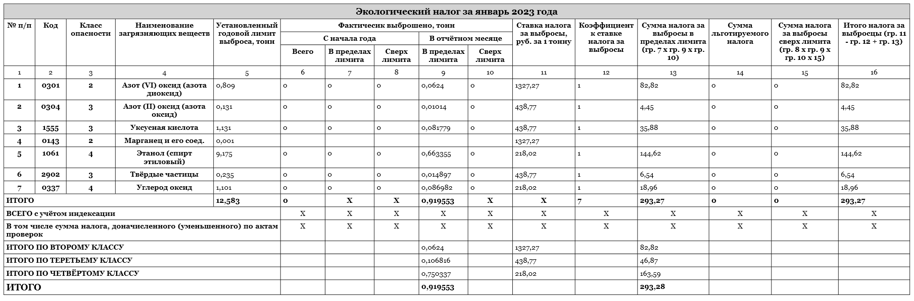

# EcologicalTaxesCalculator
### These are simple instructions for installing this application and troubleshooting any problems that may arise.

## Installing the application
To install, go to [this path](ApplicationSetup/Debug/) and:
1. Click on `ApplicationSetup.msi`
2. In the top right, **right click** the `Raw` button
3. Select `Save as...`
4. Repeat this with `setup.exe` file

This two file must be in the same folder. After installing, run `setup.exe`, *turnn off windows defender if this necessary* and follow the installation wisard instructions.
Done!

## Problems with application data
If you want to access the application data and files it collects, find this path:
`SystemDrive:\Users\UserName\AppData\Local\EcologicalTaxesCalculator\`

There are two folders - `data` and `cache`.
**Data folder** contains all the information stored in the application, such as archive entries.
**CacheFolder** contains all current application data such as bakery products, production equipment and tax parameters in the system.

All information is stored in `.xml` files. You can edit them yourself by following the preset examples.
*Tip* If one of these folders does not exist, the application may not work correctly.

## Application verification
Pre-calculated reports were used to check the calculation results. All evidence is shown below.

>Actual report

>Report calculated by the program

